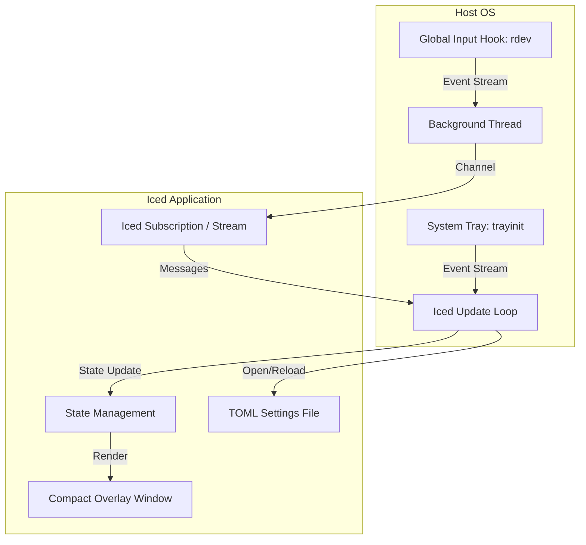

# EchoInput Design Document

`echoinput` is a keystroke and mouse event visualizer written in Rust using the `iced` GUI library. It aims to provide real-time, aesthetically pleasing visual feedback of user inputs (keys and clicks) for screencasts, presentations, and tutorials.

---

## 1. Overview & Core Features

- **Keystroke Visualizer**: Displays a history of the most recent keystrokes. Grouping logic ensures typing is aggregated into readable words/sentences rather than flooding the screen key-by-key.
- **Mouse Event Visualizer**: Planned, but not implemented yet.
- **Always-on-Top & Transparent Overlay**: The app runs borderless, transparent, and sits on top of all other windows, ignoring clicks (mouse passthrough enabled) so it does not interfere with the user's work.
- **Global Input Hook**: Since it sits in the background, it captures input events globally (even when not focused) using a dedicated worker thread.
- **System Tray Controls**: The app exposes settings, diagnostics, reload, and quit actions through a tray menu.

---

## 2. Architecture & Tech Stack

### Key Dependencies
1. **`iced` (v0.14)**: For rendering the overlay windows with transparency, borderless style, and mouse passthrough.
2. **`rdev`**: For establishing the global keyboard input hook (Linux X11, macOS, Windows).
3. **`trayinit` / `image`**: For the system tray icon and menu, using the PNG app logo as the tray icon.
4. **`tokio` / `futures`**: For async channel communication between the hook thread and the `iced` event loop.
5. **`dirs` / `toml` / `open`**: For locating, parsing, creating, and opening the user-editable settings file.
6. **`anyhow` / `log` / `humantime`**: For concise startup/setup error propagation and lightweight file diagnostics.
7. **Patched `softbuffer`**: A temporary Cargo patch is used so the macOS CoreGraphics tiny-skia presentation path preserves premultiplied alpha for transparent overlays.

---

## 3. Detailed Component Designs

### A. Window Strategy: Compact Keystroke Overlay
- The current keystroke visualizer uses a compact, borderless, transparent click-through window instead of a maximized/fullscreen overlay.
- The window size is computed from runtime layout values and keystroke limits such as history count, max active text length, font sizes, text line-height, spacing, and padding.
- The default placement is bottom-left with a screen margin. Once the monitor size is known, the window is clamped to the monitor's available area inside that margin. Placement is not configurable yet, but the runtime layout values are structured so this can be added later.
- The app uses iced's daemon API so it can own the click-through overlay while still running global subscriptions.
- If the overlay window is closed, the daemon exits instead of continuing invisibly.
- Windows hides the overlay from the taskbar through winit platform settings. Linux/X11 sets utility, skip-taskbar, skip-pager, and above window-manager hints after creation. macOS uses an accessory activation policy and removes the overlay shadow.
- On macOS, the tiny-skia renderer requires the patched `softbuffer` CoreGraphics backend because the upstream 0.4.8 backend declares the presented `CGImage` alpha as skipped, which makes transparent pixels show as black.
- Future cursor-following mouse visualization may need a separate window or a different overlay strategy.

### B. Keystroke Grouping Algorithm
- Normal keys (alphanumeric and symbols) are appended to the *current active bubble*.
- Delimiters like `Space`, `Enter`, or `Tab` are appended to the same event row and then finalize the active typing bubble.
- **Inactivity Timeout**: If no keystroke occurs for `1` second, the current bubble is finalized. Subsequent typing starts a new bubble.
- **History Expiration**: Finalized bubbles disappear after `5` seconds. Duplicate key-only bubbles refresh their expiration when their repeat count increases.
- **History Limit**: The number of finalized history rows is configurable from `1` to `10`, defaults to `5`, and is persisted to TOML settings.
- **Active Text Limit**: Active text is capped at 24 characters before it is split into a new history row. A delimiter may appear after that text as an extra bubble in the same row.
- **Backspace Handling**:
  - If a Backspace key is pressed while text is active, the active text bubble is finalized first.
  - Backspace is displayed as a special key bubble instead of editing the active text bubble. Consecutive Backspaces are compressed with the repeat indicator.
- **Modifiers & Shortcut commands**:
  - Keys combined with command-style modifiers (Control, Alt/Option, or Super/Command) immediately finalize the active typing bubble and display as one shortcut row.
  - Shortcut rows render each modifier/key as a separate bubble in the same row, e.g. `Super+Shift+S` appears as three adjacent bubbles.
  - A subtle modifier row is always visible at the bottom and highlights held modifiers.
- **Duplicate Compression**: Adjacent finalized key-only bubbles with the same content and kind are collapsed into one history entry with a small inline repeat count such as `×2` or `×3`. Text bubbles are not compressed.
- **Expiration Order**: History expiration times are monotonic because new bubbles append to the back and only the latest duplicate bubble can be refreshed. Expiration pruning only removes from the front of the queue.

### C. Mouse Event Follower
- Not implemented in the current vertical slice.
- Tracks global mouse pointer coordinates via `rdev`.
- A modern, semi-transparent mouse silhouette is drawn on the overlay at the cursor position.
- **Visual Feedback**:
  - Left click button area glows bright neon blue (e.g., `#00d2ff`) with a pulse effect.
  - Right click button area glows bright neon pink (e.g., `#ff007f`).
  - Scroll wheel area lights up showing a directional arrow (↑ or ↓) depending on the scroll direction, which fades out after 300ms.

### D. Settings
- The tray menu can open the TOML settings file in the OS default editor.
- Settings are persisted as TOML at `dirs::config_dir()/echoinput/settings.toml`. If the file is missing, EchoInput writes an initial commented config with defaults.
- Settings currently include `history_limit`.
- The tray menu can reload settings from disk. Successful reloads apply immediately, trim excess history rows, and resize/reposition the overlay. Invalid settings are logged and the current runtime settings remain active.

### E. Diagnostics
- Diagnostics are written to `dirs::data_local_dir()/echoinput/echoinput.log`.
- The current log rotates to `echoinput.old.log` when it exceeds the size cap.
- Logging is fixed to `info`, `warn`, and `error` records. `debug` and `trace` records are compiled out via `log/max_level_info`.
- The tray menu can open the current diagnostics log with the OS default application.

---

## 4. Tray Menu

The system tray is the current control surface:
- `Open Settings`: Open the TOML settings file.
- `Reload Settings`: Reload settings from disk.
- `Open Log`: Open the diagnostics log file.
- `Quit`: Exit EchoInput.

---

## 5. Target OS Support

- **Linux**: Targets X11 desktop environments (requires Xlib development headers for building).
- **Windows / macOS**: Cross-platform support is designed out of the box through `rdev`'s native platform event hooks.
- **macOS transparency note**: The current dependency set patches `softbuffer` so tiny-skia windows use premultiplied alpha in the CoreGraphics presentation path. Without this patch, transparent overlay pixels render black on macOS.

---

## 6. Implementation Status

Current stage: **first vertical slice / keystroke visualizer**.

Completed:
- Compact transparent `iced` overlay window sized from layout and keystroke limits.
- Monitor-aware overlay clamping so the compact window does not extend beyond the available screen area.
- Always-on-top borderless window configuration.
- Mouse passthrough enablement after window creation.
- Global input hook subscription through `rdev`.
- System tray menu with settings, reload, log, and quit actions.
- Keystroke grouping with active typing rows, delimiter rows, shortcut rows, explicit Backspace display, and held modifier indicators.
- Adjacent duplicate bubble compression for repeated keys and shortcuts.
- Five-second expiration for finalized bubbles.
- Bottom-left bubble rendering using the dedicated icon font for keyboard glyphs and monospace text for typed text.
- TOML settings file with persisted history row count and tray-driven reload/open actions.
- Lightweight rotating file logging with tray-driven log opening.
- macOS tiny-skia transparency through a patched `softbuffer` CoreGraphics backend.

In progress / next:
- Manual verification of keystroke grouping behavior on the target OS.
- Mouse follower rendering and click/scroll feedback.
- Future tray status/error indication and richer tray actions.
